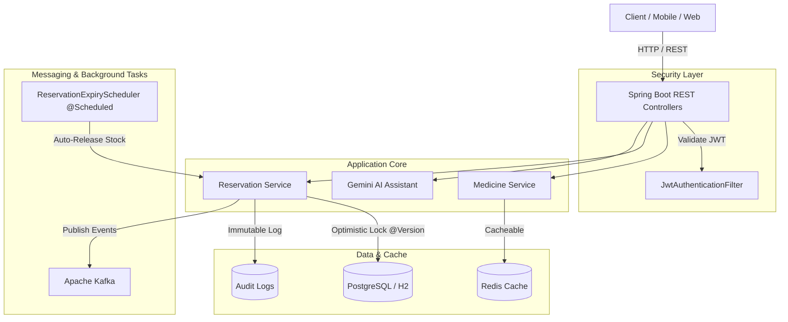

# SentinelGrid – Emergency Medicine Platform


**SentinelGrid** is a production-ready, cloud-native emergency medicine reservation and availability platform designed for high concurrency, real-time inventory management, and audit compliance. Built as an MCA final-year capstone project demonstrating enterprise backend engineering practices.

---

## 🚀 Key Features

* **AI Medicine Search Assistant (Gemini API)**: LLM-powered natural language normalization converts informal queries (e.g., *"snake bite injection near me"*) into normalized emergency medicines (*"Anti-Venom Polyvalent Injection"*) and retrieves live availability.
* **Real-time Emergency Medicine Search**: Query nearby pharmacies and availability by medicine name, brand, or city with Redis-backed caching (`@Cacheable`).
* **Optimistic Locking & Concurrency Protection**: Utilizes JPA `@Version` on inventory and reservations to guarantee zero double-booking during peak emergency requests.
* **Double-Booking Prevention**: Restricts patients from holding multiple active (`PENDING`) reservations within the same medicine category.
* **Automated TTL Expiry Rollback**: Spring `@Scheduled` background worker scans for uncollected reservations past their expiry window (30-minute default), automatically releases reserved stock, updates state to `EXPIRED`, and logs audit records.
* **Event-Driven Architecture (Kafka)**: Emits `ReservationCreatedEvent` and `ReservationExpiredEvent` for async notifications, downstream integration, and telemetry.
* **Role-Based Access Control (RBAC)**: Secured via Spring Security and JWT authentication supporting `PATIENT`, `PHARMACIST`, and `ADMIN` roles.
* **Immutable Audit Log**: Every state transition (creation, pickup confirmation, cancellation, expiry) is recorded with entity details, operator identity, and timestamp.
* **OpenAPI / Swagger UI Documentation**: Fully annotated endpoints accessible at `/swagger-ui.html`.

---

## 🛠️ Technology Stack

| Layer | Technology |
| :--- | :--- |
| **Language & Runtime** | Java 21 LTS |
| **Framework** | Spring Boot 3.2.3 (Web, Data JPA, Security, Validation, Cache) |
| **Security** | Spring Security + JJWT 0.12.5 (JSON Web Tokens) |
| **Database** | PostgreSQL 15 (Docker/Prod), H2 (Local Dev/Tests) |
| **Cache** | Redis (Spring Cache Abstraction) |
| **Event Broker** | Apache Kafka + Zookeeper |
| **API Docs** | Springdoc OpenAPI 2.3.0 |
| **Containerization** | Docker, Docker Compose (Eclipse Temurin JDK 21) |
| **CI/CD** | GitHub Actions Workflow (`.github/workflows/ci.yml`) |
| **Testing** | JUnit 5, Mockito, Testcontainers (PostgreSQL) |

---

## 📁 Package Structure

`base package: com.sentragrid`

```
com.sentragrid
├── config              # Security, OpenAPI, Redis, Kafka, Scheduling configs
├── security            # JwtTokenProvider, JwtAuthenticationFilter, CustomUserDetailsService
├── auth                # AuthController, AuthService, Auth DTOs
├── common              # BaseEntity, ApiResponse, AppConstants
├── exception           # GlobalExceptionHandler, Custom Exceptions
├── entity              # User, Role, Pharmacy, Medicine, Inventory, Reservation, AuditLog
│   └── enums           # UserRole, InventoryState, ReservationStatus
├── repository          # UserRepository, PharmacyRepository, MedicineRepository, InventoryRepository, ReservationRepository, AuditLogRepository
├── dto                 # Request & Response DTOs
├── service             # MedicineService, PharmacyService, ReservationService
├── controller          # AuthController, MedicineController, PharmacyController, ReservationController
├── kafka               # KafkaProducerService, KafkaConsumerService, Event DTOs
├── scheduler           # ReservationExpiryScheduler
└── audit               # AuditLog entity, repository, and service
```

---

## 🏗️ Architecture Overview



*Architectural Diagram placeholder image:*


---

## ⚙️ Concurrency & Reservation Lifecycle

```
[Patient Request] -> [Check Active Reservation in Category]
                          │
                          ▼
                 [Fetch Inventory]
                          │
                          ▼
             [Check Available Quantity]
                          │
                          ▼
          [Reserve Stock & Increment @Version] ──── (Conflict?) ──> [OptimisticLockException / HTTP 409]
                          │
                          ▼
           [Create Reservation (PENDING)]
                          │
                          ├───────────────────────────────┐
                          ▼                               ▼
               [Pickup Confirmed]              [TTL Expired / Cancelled]
                          │                               │
                          ▼                               ▼
                 [Deduct Total Stock]           [Release Reserved Stock]
                          │                               │
                          ▼                               ▼
               [Status: CONFIRMED]              [Status: EXPIRED / CANCELLED]
```

---

## 🏃 Running Locally

### Prerequisites
* Java 21 SDK
* Maven 3.8+
* Docker & Docker Compose (Optional for containerized mode)

### Option 1: Local Development (H2 In-Memory)

> **Note:** The project runs with **H2 for local development** and **PostgreSQL for production / Docker deployment**.

Run the application locally without requiring external PostgreSQL/Redis/Kafka servers (H2 in-memory DB enabled by default):

```bash
# Clone repository
git clone https://github.com/Mappillai-Meeran/SentinelGrid.git
cd SentinelGrid

# Build project and run tests
mvn clean package

# Run Spring Boot application
mvn spring-boot:run
```

* **Swagger UI**: [http://localhost:8080/swagger-ui.html](http://localhost:8080/swagger-ui.html)
* **H2 Console**: [http://localhost:8080/h2-console](http://localhost:8080/h2-console) (`JDBC URL: jdbc:h2:mem:sentineldb`, User: `sa`, Password: empty)

---

### Option 2: Docker Compose (Full Stack)

Start all services (App, PostgreSQL, Redis, Zookeeper, Kafka):

```bash
docker-compose up --build -d
```

Check status of containers:
```bash
docker-compose ps
```

Stop services:
```bash
docker-compose down
```

---

## 🔐 Demo Credentials

| Role | Username | Password |
|------|----------|----------|
| Patient | `patient1` | `password123` |
| Pharmacist | `pharmacist1` | `password123` |
| Admin | `admin1` | `password123` |

---

## 📡 REST API Reference

| Endpoint | Method | Auth | Description |
| :--- | :--- | :--- | :--- |
| `/api/auth/register` | `POST` | Public | Register new user (`PATIENT`, `PHARMACIST`, `ADMIN`) |
| `/api/auth/login` | `POST` | Public | Login and obtain JWT token |
| `/api/ai/search-assist` | `POST` | Public | AI natural language search normalization & lookup (Gemini API) |
| `/api/medicines/search` | `GET` | Public | Search available medicines by name and city (Cached) |
| `/api/reservations` | `POST` | `PATIENT`, `ADMIN` | Create a medicine reservation |
| `/api/reservations/{id}/confirm` | `POST` | `PHARMACIST`, `ADMIN` | Confirm medicine pickup |
| `/api/reservations/{id}/cancel` | `POST` | `PATIENT`, `PHARMACIST`, `ADMIN` | Cancel an active reservation |
| `/api/reservations/my` | `GET` | `PATIENT`, `ADMIN` | View current patient's reservations |
| `/api/pharmacies/{id}/inventory` | `GET` | Public | Get pharmacy stock list |
| `/api/pharmacies/{id}/inventory` | `PUT` | `PHARMACIST`, `ADMIN` | Update pharmacy stock levels |

---

## ⚡ Quick API Test

### Login

```bash
curl -X POST http://localhost:8080/api/auth/login \
  -H 'Content-Type: application/json' \
  -d '{"username":"patient1","password":"password123"}'
```

### Search Medicine

```bash
curl 'http://localhost:8080/api/medicines/search?name=Remdesivir'
```

---

## 📸 Screenshots

| Feature | Screenshot |
|---------|------------|
| Login Success |  |
| AI Search |  |
| Medicine Search |  |
| Reservation Created |  |
| Inventory Verification |  |
| Audit Logs |  |

---

## 🧪 Testing

The test suite includes unit tests, multi-threaded optimistic concurrency tests, and database integration tests:

```bash
# Run unit and concurrency tests
mvn test

# Run all tests (including Testcontainers PostgreSQL integration tests)
mvn verify
```

* **Unit Tests**: `ReservationServiceTest` using Mockito.
* **Concurrency Test**: `ReservationConcurrencyTest` using `CountDownLatch` and multi-threading to prove optimistic locking prevents double booking.
* **Repository Integration Test**: `ReservationRepositoryTest` running against containerized PostgreSQL using Testcontainers.

---

## 🔭 Future Scope

1. **Geo-location Proximity Search**: Integration with PostGIS for real-time distance sorting based on latitude/longitude coordinates.
2. **Prescription Verification Pipeline**: AI-driven OCR validation for prescription uploading before high-risk antiviral medicine reservation.
3. **Push & SMS Notifications**: Integration with Twilio / Firebase for SMS and WebPush alerts on medicine availability and expiration reminders.

---

## 👨‍💻 Author

**Mappillai Meeran A**
* MCA – Sri Manakula Vinayagar Engineering College
* GitHub: [https://github.com/Mappillai-Meeran](https://github.com/Mappillai-Meeran)
* LinkedIn: [https://www.linkedin.com/in/mappillaimeeran](https://www.linkedin.com/in/mappillaimeeran)

